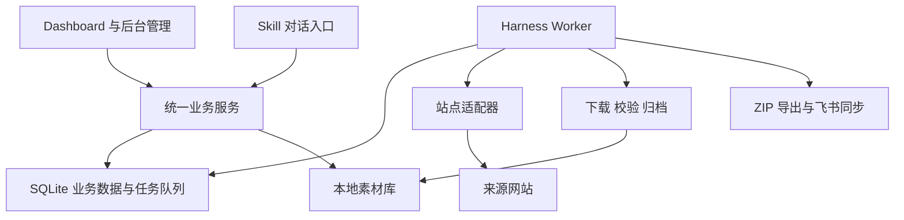

# Fashion Scout Harness

面向海外女装独立站的本地新品巡检与素材管理系统设计：通过 **Skill + Harness + Dashboard**，将商品发现、图片采集、归档分类和选品整理连接为可追踪、可恢复的工作流程。

> **当前状态：设计阶段。** 本仓库目前只有需求与架构文档，没有可运行的采集程序、管理后台或已安装的 Skill。文档中的模块、接口和页面均为设计目标，不代表功能已经实现或网站已经适配。

## 为什么做这个项目

跨境女装选品需要反复访问多个网站，寻找近期款式，打开商品详情，保存多角度和细节图片，再整理到本地文件夹。人工操作耗时，也容易漏图、重复下载或失去来源信息。

本项目希望让使用者在页面点击一次“开始巡检”，即可查看各站点进度、发现的商品、已保存的图片和异常原因，并在本地素材库中继续分类、收藏和导出。

## 拟定的第一版形态

- **Windows 本地运行**：浏览器打开管理后台，后台服务独立执行采集。
- **D 盘存储**：图片目录可配置，示例为 `D:\女装素材库`。
- **手动触发**：页面或 Skill 发起任务；定时采集默认关闭。
- **Harness 控制执行**：持久化任务、站点限速、有界重试、恢复、去重和文件校验。
- **Dashboard 查看事实**：按天查看任务、商品、图片、分类和存储情况，并下钻到明细。
- **人工选品**：商品分类、标签、收藏和候选状态；AI 分类作为后续扩展。
- **按需输出**：ZIP 导出与飞书同步分别记录结果。

## 文档

| 文档 | 内容 |
| --- | --- |
| [需求与架构设计](docs/architecture.zh-CN.md) | 目标、边界、模块、数据模型、任务状态、存储、页面、验收标准 |
| [分阶段路线图](docs/roadmap.zh-CN.md) | 从样本站点验证到本地闭环，再到扩展能力的推进顺序 |

## 架构概览

## 项目边界

本项目服务于商品发现和参考素材整理，不包含销量预测、自动设计、自动生产或自动上架。网站适配能力需要逐站验证；首次发现商品不等于商品刚刚上架，下载成功也不等于全站或详情页已完整覆盖。

公开仓库不包含实际业务站点清单、登录会话、第三方服务标识、采集图片或运行数据。使用者需自行配置合法可访问的数据来源；采集应遵守来源网站的访问规则及适用权限，图片权利归原权利人所有。

## 参与讨论

欢迎通过 Issues 讨论架构、站点适配策略、任务恢复和本地素材管理。请使用公开或脱敏示例，并注明是设计建议、实现结果还是实际站点验证结果。

## License

本仓库自有文档及未来纳入本仓库的代码按 [MIT License](LICENSE) 开源。第三方网站内容和商品图片不因此获得重新授权。
