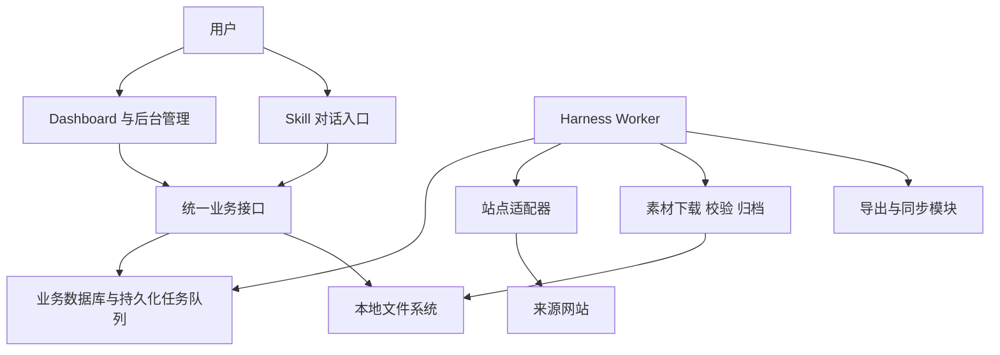
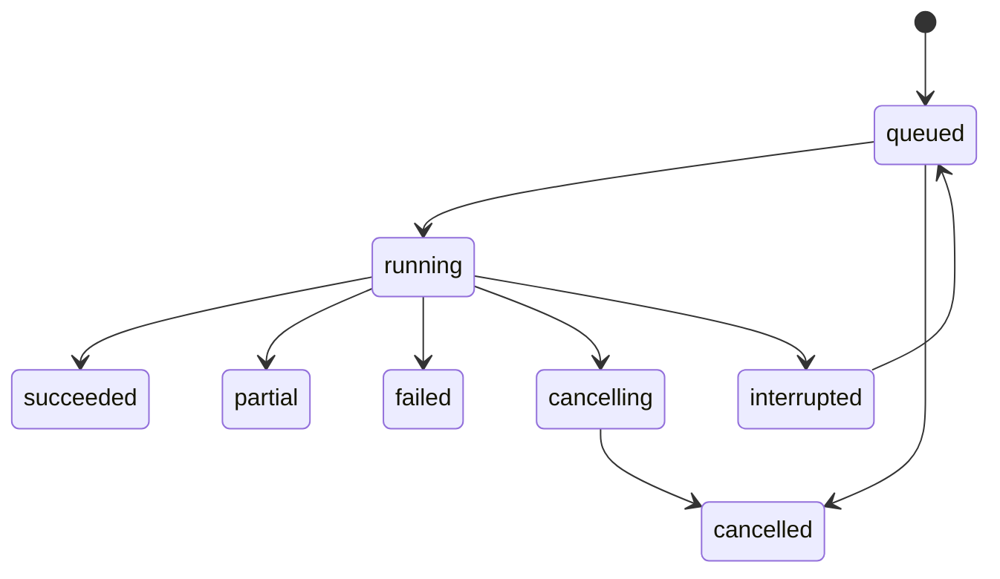

# Fashion Scout Harness：需求与架构设计

- 版本：v0.1
- 日期：2026-10-06
- 状态：架构草案，供后续设计评审和实现使用
- 实现状态：尚未实现；无网站适配、采集效果、后台可运行性或安装验证声明

## 1. 产品目标

面向跨境女装选品，将海外独立站的新品发现、商品图片收集、本地归档、分类筛选和结果导出组织成持续可用的工作流程。

使用者应能在页面选择站点和时间窗口，启动巡检，查看进度与结果，并回答：

1. 今天是否执行过巡检？哪些站点完成，哪些失败？
2. 哪些商品是首次发现，哪些有来源网站提供的近期上架依据？
3. 图片实际保存了多少，是否缺失，来自哪个商品？
4. 本地有哪些类别和候选款式，还有多少商品需要分类？
5. 能否只重试失败部分，并导出选定的商品与图片？

## 2. 范围与设计基线

| 项目 | 第一版设计 |
| --- | --- |
| 部署 | Windows 本机，单用户为主 |
| 页面 | 浏览器管理后台，Dashboard 为首页 |
| 存储 | 本机磁盘，图片根目录可配置，默认示例为 `D:\女装素材库` |
| 启动方式 | 页面手动点击或 Skill 对话触发 |
| 时间窗口 | 默认近 14 天，可选择近 7 天；每次任务固定起止时刻 |
| 定时采集 | 默认关闭，作为后续可配置能力 |
| 页面关闭 | 不终止已由后台接受的任务 |
| 电脑关机或休眠 | 停止实际采集；服务恢复后根据持久化记录恢复未完成步骤 |
| 分类 | 商品类别、标签、选品状态；首版人工操作 |
| 输出 | 本地浏览和 ZIP；飞书为独立可选集成 |
| 数据权威 | 数据库管理配置和业务记录；TXT/JSON 为导入导出格式 |

初期不包含销量预测、爆款保证、服装设计生成、生产管理、自动上架和多租户平台。完整技术栈和站点支持清单在后续验证阶段确定。

## 3. 总体架构

采用模块化单体代码库，部署为 Web 服务和 Worker 两个常驻进程。两者复用业务模型和数据访问模块，不需要在第一版引入微服务或独立消息中间件。



### 3.1 模块职责

| 模块 | 职责 | 边界 |
| --- | --- | --- |
| Skill | 理解意图、补齐必要参数、调用业务接口、解释结果 | 不以对话历史保存任务进度，不直接改数据库或代替执行器重试 |
| Web/API | 配置、查询、任务创建、分类管理、素材预览 | 请求接受后返回任务标识，不在 HTTP 请求中执行完整巡检 |
| Harness | 调度、状态转换、并发、限速、超时、重试、恢复、完成判定 | 不硬编码各站点 HTML 结构 |
| 站点适配器 | 发现商品、分页、解析详情和图片、输出证据 | 不直接决定全局任务成功，不绕过来源站访问限制 |
| 素材管理 | 下载、文件校验、去重、归档、缩略图、文件核验 | 与商品分类分离，分类变化不触发原图搬迁 |
| 输出模块 | ZIP、清单、飞书同步及失败恢复 | 输出状态与采集状态独立 |
| 数据层 | 保存任务、商品、观察记录、文件关系和分类 | 为页面与 Skill 提供相同口径 |

### 3.2 进程生命周期

Web 和 Worker 由本机启动器或进程管理机制启动，具体打包方式后续选择。浏览器和 Codex 对话均为客户端，关闭它们不应终止 Worker。

当 Web 可访问但 Worker 不在线时，页面显示“执行器离线”；已创建任务保持排队，不显示成正在抓取。是否随 Windows 启动由用户配置。第一版服务默认仅监听本机地址，远程访问与多人权限另行设计。

## 4. Skill 与统一操作入口

Skill 是自然语言操作入口，页面是可视化入口；二者复用同一套业务服务。

| 能力 | 示例 | 返回的事实 |
| --- | --- | --- |
| 创建巡检 | 检查选中站点近 14 天新品 | `run_id`、参数快照、排队状态 |
| 查询进度 | 今天的巡检完成了吗 | 当前阶段、计数、异常及记录链接 |
| 重试失败项 | 重试这次失败的图片 | 新的尝试记录与原任务关联 |
| 查询素材 | 查看本周发现的连衣裙 | 商品、分类、图片和来源 |
| 分类选品 | 将这些款式加入候选 | 更新结果与变更记录 |
| 导出 | 导出选定商品的图片 | 导出任务标识及完成后的下载入口 |

业务接口负责验证范围、参数与当前状态。自然语言表达不能直接成为文件路径或任意系统命令。Skill 中将包含操作说明、参数约定、错误解释和必要的调用封装，运行数据留在系统内。

常规采集流程由确定性程序执行。AI 分类、特殊页面解析可作为后续扩展，输出必须经过结构校验，并记录版本、依据和人工修正。

## 5. Harness 执行模型

### 5.1 任务层级与配置快照

```text
Run：一次巡检
  SiteRun：一个站点在本次巡检中的执行
    ProductItem：一个商品在本次巡检中的处理
      ImageItem：一个图片来源的下载与归档
```

创建 Run 时保存站点及入口范围、窗口起止值、配置版本、适配器版本、触发来源和唯一标识。运行期间修改配置只影响后续任务。

相同请求的重复提交使用幂等标识返回已有任务；其他任务进入队列。首版同一时刻执行一批巡检，批次内部按站点控制有限并发。任务队列持久化到数据库，网络请求和图片下载不持有数据库长事务。

### 5.2 执行步骤

1. 预检：存储目录可写、磁盘余量、配置有效、执行器可用。
2. 分页发现商品：记录入口、游标、页数、扫描上限及覆盖情况。
3. 记录观察结果：商品信息、发布时间依据、首次发现时间、原始来源引用。
4. 判定处理范围：区分有时间依据的近期商品、首次发现商品、新品候选。
5. 解析商品图片：记录图集、变体和详情内容等实际支持的来源范围。
6. 下载与校验：检查可复用文件；下载缺失或需要更新的图片。
7. 归档与预览：保存原图、关系、缩略图和可检索元数据。
8. 汇总：保存结果、计数、失败原因和完成证据。

ZIP 和飞书同步创建独立任务，关联来源 Run 或所选商品快照。

### 5.3 状态、恢复与取消



Worker 使用任务租约和心跳。恢复前确认旧执行者已失效；状态写入检查租约代次，防止过期执行者覆盖新执行结果。每个步骤必须可安全重入，恢复时复用已完成的文件和记录。

取消属于协作式取消：停止领取新步骤，在当前步骤的安全边界退出，保留已完成数据。重试创建新的 Attempt 并关联原记录，保留失败历史；计数根据业务记录去重，而不是把重试次数累计成新增图片。

### 5.4 异常处理

| 情况 | 处理 |
| --- | --- |
| 429 或临时网络错误 | 尊重来源站重试提示，按站点退避；重试次数有上限 |
| 登录、验证或访问限制 | 标记需要人工处理，不无限循环或绕过限制 |
| 页面结构变化 | 标记解析失败，保留最小必要证据，继续其他站点 |
| 分页不完整 | 记录未覆盖范围，不宣称完整扫描 |
| 图片损坏或响应不是图片 | 不计入成功保存，记录并按策略重试 |
| 磁盘空间不足 | 停止新增下载，保留可恢复记录，提示处理空间 |
| Worker 退出 | 租约到期后识别中断；服务恢复后重入未完成步骤 |
| 飞书同步失败 | 独立重试同步，不重新执行已成功采集 |

日志记录安全错误码、简短原因、下一步和关联标识。不得把 Cookie、令牌或完整私密请求头写入日志。

## 6. 站点适配与新品判定

### 6.1 适配策略

优先利用网站正常公开提供的结构化数据；不可用时，根据站点能力使用页面解析或浏览器适配。不能假定所有 Shopify 网站都开放 `products.json`，也不能把一次 `limit=250` 请求当作完整商品目录。

适配器统一输出商品标识、标题、链接、价格及币种、来源时间字段、图片来源列表、分页信息和覆盖证据。按站点保存能力信息，例如：能否获取发布时间、是否支持完整分页、可提取哪些图片区域。

### 6.2 三种时间分别记录

| 时间 | 含义 |
| --- | --- |
| `source_published_at` | 来源站提供的发布时间，允许为空 |
| `first_seen_at` | 本系统第一次观察到商品的时间 |
| `observed_at` | 本次实际采集的时间 |

创建时间与发布时间不混用。进入 New In 栏目仅作为候选信号；图片 URL 中的版本参数不能单独证明商品上新。第一次采集建立基线，不将全部首次发现商品标成近期上架。

首版界面分别展示“源站标注近期发布”“首次发现”“新品候选”。未知发布日期商品是否进入下载范围必须在任务参数中明确，不能悄悄按日期已知处理。建议首轮预览未知日期候选数量，再确定是否纳入下载。

### 6.3 图片覆盖与质量

保留原始来源 URL，由站点适配器处理已知尺寸或格式转换参数；不采用全站统一删除查询参数的策略。下载结果记录实际格式和像素尺寸，无法确认原始尺寸时标记为“原图尺寸未验证”。

覆盖范围按商品图集、变体图、详情内嵌图等记录。仅拿到商品主图或图集时，不声称已经获得详情页全部图片。数量增长过程中展示“已处理 / 已发现”，扫描完成前不显示虚假的总进度百分比。

## 7. 数据模型

| 对象 | 关键字段与关系 |
| --- | --- |
| Site | 域名、入口、范围、适配器、配置版本、启用状态 |
| Run | 参数快照、触发来源、状态、窗口、起止时间 |
| SiteRun / ProductItem / ImageItem | 分层进度、幂等标识、覆盖、状态 |
| Attempt | 步骤、次数、执行者、错误、起止时间 |
| Product | 站点内稳定标识、当前标题、链接、价格及币种 |
| Observation | Run、商品、本次字段值、时间依据、来源引用 |
| ProductImage | 商品与图片来源的关系、顺序、来源版本 |
| Asset | 文件相对路径、内容哈希、格式、尺寸、大小、状态、核验时间 |
| Category / Tag | 商品分类、多标签和人工变更记录 |
| Selection | 待看、候选、收藏、排除等选品状态 |
| ExportJob / SyncJob | 选择范围快照、来源任务、输出、执行状态 |

商品用“站点 + 来源稳定 ID”识别；没有稳定 ID 时，适配器定义并版本化规范化链接或 handle 策略。不同站点的相似商品不自动合并。

URL 用于定位来源，文件内容哈希用于判断内容是否相同，两者不是同一标识。相同 URL 内容变化、图片顺序变化时保留来源版本关系；不能只看到 URL 已存在就永远跳过更新检查。

数据库存储 UTC 时间，界面和日报按配置时区展示；初始业务时区为 `Asia/Shanghai`。

## 8. 本地存储与一致性

```text
D:\女装素材库\
├─ originals\
│  └─ 站点域名\
│     └─ 商品稳定ID\
│        ├─ 01_图片ID.jpg
│        └─ 02_图片ID.png
├─ thumbnails\
├─ exports\
└─ temp\

D:\女装采集系统\data\
├─ database\
├─ logs\
├─ config\
└─ backups\
```

以上均为示例路径，可配置，不写死在 Skill 中。文件名使用安全标识，避免商品标题中的特殊字符、Windows 保留名称和路径长度问题。接口通过 Asset 标识访问文件，并检查解析路径始终位于配置的素材根目录内。

### 8.1 下载与归档

先将文件下载到同一存储卷的临时路径，校验可解码性、格式、尺寸和哈希，再以唯一文件名归档，最后提交文件与商品关系。文件系统和数据库没有共同事务，因此必须实现恢复核对，处理孤立文件、缺失文件和未完成记录。

重复巡检复用同商品已校验文件。跨商品相同内容可复用下载结果，但保留各商品完整归档和来源关系；首版不承诺全局物理存储去重。目录中的图片顺序由关系数据记录，顺序变化不覆盖已有内容。

### 8.2 文件核验、备份与迁移

提供按需核验任务，检查文件存在性、大小和必要时的内容哈希，显示最近核验时间。发现缺失后支持补抓；不凭数据库有路径就宣称本地文件健康。

数据库使用一致性备份机制，原图单独备份。缩略图可以重新生成；备份目录与原文件位于同一磁盘不构成磁盘损坏保护。

修改存储根目录仅改变后续配置，不隐式移动历史数据。未来迁移功能应独立执行复制、校验和引用切换。自动删除原图、覆盖用户目录和批量清理不在首版默认行为中。

## 9. 分类与选品

以商品为分类单位，图片继承其商品归属。

| 维度 | 示例 |
| --- | --- |
| 类别 | 连衣裙、上衣、半身裙、套装 |
| 标签 | 印花、长袖、通勤、度假 |
| 选品状态 | 待看、候选、已收藏、已排除 |

分类修改更新数据库，不移动原图。按类别导出时再生成对应目录，避免多标签导致素材反复复制或搬迁。

首版支持人工批量分类和修正。后续 AI 分类单独保存建议、依据、模型版本和人工确认结果，不能覆盖已经确认的人工分类。

## 10. Dashboard 与后台页面

| 页面 | 主要内容与操作 |
| --- | --- |
| 总览 | 当日任务、站点结果、新发现商品、图片保存、待分类、存储与执行器状态 |
| 采集任务 | 站点选择、时间窗口、范围预览、启动、取消、重试、步骤明细 |
| 商品与图片库 | 封面、完整图集、来源、价格、发现时间、类别和选品状态筛选 |
| 分类与选品 | 类别与标签维护、待分类、批量修改、候选和收藏 |
| 站点管理 | 增删、启停、入口、适配能力、最近成功与异常 |
| 导出与同步 | ZIP、导出清单、飞书任务、失败重试 |
| 存储与系统设置 | 根目录、磁盘余量、文件核验、备份、时区和本机服务状态 |

### 10.1 统计口径

- 没有任务的日期显示“未巡检”，不能显示“无新品”。
- 站点失败或扫描不完整，不能记为“没有新款”。
- 首次发现商品与来源站标注近期发布商品分开统计，二者可能重叠，不能直接相加。
- 每日新增按业务标识去重；尝试次数、复用图片、重新补回图片单独记录。
- 商品数、图片关系数、物理文件数和占用空间分别统计。
- 采集进度、人工分类进度、导出进度分别展示。
- 所有指标可下钻到明细，明确统计时间和最近文件核验时间。

## 11. 数据权威与外部输出

数据库是站点、任务和业务数据的权威来源。`网站链接.txt` 提供批量导入、导出；导入前展示新增、更新和冲突，不因为某一行缺失就自动删除已有站点。JSON 可用于诊断导出或迁移，不与数据库双向独立维护。

飞书是结果输出渠道，具体目标在本地配置，不写入公开仓库。同步状态与采集结果独立；重试根据稳定业务标识更新目标记录，避免同一天多次执行生成重复行。选定飞书 API 后再固定表结构与幂等映射。

ZIP 支持按任务、日期、站点或所选商品导出，明确选择“本次新增图片”还是“所选商品的全部已存图片”。包内包含清单，列出来源、图片数量、相对路径、缺失项和选择范围；缺失图片不能被静默当作完整交付。

## 12. 技术选择与本机访问边界

采用 SQLite 保存业务记录和持久化任务队列，原图保存在文件系统。SQLite 适用于本机应用与有限写并发；所有写入保持短事务，网络采集和文件下载不占用长事务。需要多机执行或明显增加写并发时，再评估服务端数据库与任务系统。

Web/API 和 Worker 复用同一套业务模块。前后端语言、框架、浏览器自动化工具和 Windows 打包方式在实现准备阶段选择，不作为当前功能已经可运行的依据。

本机接口也需限制允许的 Origin、校验会话与写操作请求，防止外部网页意外触发本地任务。采集只接受配置的 HTTP/HTTPS 来源，限制回环、内网和重定向目标，避免站点输入被用于访问本地服务。Cookie、令牌和飞书凭据保存在受控本地配置中，不进入仓库、日志或导出包。

第三方网页文本、商品标题和图片描述均作为数据处理，不执行其中对 Agent 或系统发出的指令。

## 13. 第一版完成标准

| 场景 | 验收标准 |
| --- | --- |
| 正常巡检 | 页面可选站点、固定窗口并启动，任务与文件结果可追溯 |
| 离开页面 | 关闭页面或对话，后台继续；重开可查询同一任务 |
| 重复提交 | 相同操作不产生重复执行或错误的新增计数 |
| 站点失败 | 不阻断其他站点；失败原因、覆盖不足和总体状态准确 |
| 图片失败 | 不计入成功，可只重试失败图片 |
| 进程中断 | 服务恢复后识别中断步骤，保留已完成结果并安全恢复 |
| 本地缺失 | 核验发现缺失文件，页面标明并支持补抓 |
| 分类操作 | 批量修改可查，后续采集不覆盖人工分类 |
| 导出 | 包内文件、清单和选择范围一致，缺失项显式呈现 |
| 每日统计 | 区分未巡检、无结果、失败、候选与首次发现 |

“一次巡检成功”要求所选范围扫描和必需处理步骤完成，结果和文件均有证据。若部分站点或图片失败，则为部分成功；没有形成有效采集结果的执行失败则为失败。全部站点成功扫描但未发现商品，仍可为成功。分类待处理不阻止采集成功，导出失败不抹去已完成采集。

## 14. 已选方向与待验证事项

本草案采用本地运行、D 盘可配置存储、页面与 Skill 共用接口、独立 Worker、SQLite 队列、商品级分类等方向。架构发布不代表所有细节已经获得实现验证。

进入开发前需验证：

1. 样本站点可访问的数据、分页、发布时间和图片覆盖边界。
2. 首次巡检的候选规模、未知日期商品下载规则和合理扫描上限。
3. 图片体积、磁盘增量和合适的限速与并发参数。
4. 稳定商品标识、图片更新识别和重试幂等策略的样本表现。
5. 本机常驻进程的启动、退出、心跳失效及恢复方式。

路线图见 [分阶段路线图](roadmap.zh-CN.md)。

## 15. 参考资料

- [SQLite 适用场景](https://www.sqlite.org/whentouse.html)：本机应用与写入并发边界。
- [SQLite WAL](https://www.sqlite.org/wal.html)：并发与日志机制；具体配置在实现阶段验证。
- [Shopify JSON 字段说明](https://help.shopify.com/en/manual/shopify-admin/using-json)：创建时间与发布时间的语义；不是对第三方网站接口可访问性的保证。
- [Shopify Image 对象](https://shopify.dev/docs/api/storefront/2026-01/objects/Image)：图片尺寸与转换语义；不是对所有来源均能取得原图的保证。
