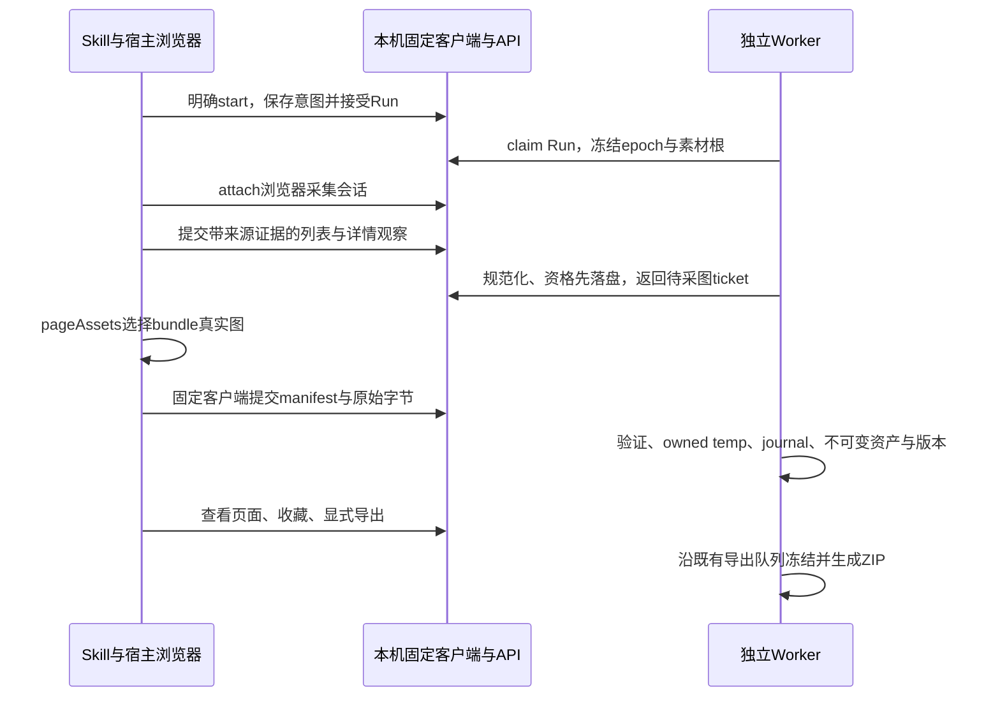

# T2 正常浏览器采集桥接：最小实施提案

原任务p2-collection/t2-futario-media，当前仅离线方案，未正式submit或实施。依据Manager的browser-html-success备忘、pageAssets能力文档、真实详情/单图诊断及已验收schema9代码。Manager已向用户确认A03选择；等待答案期间本方案不假定可降低“关闭Codex后继续取来源”的要求。

## 推荐与边界

推荐先采用**Codex/Skill宿主正常浏览器获取来源，本机独立Worker自动校验归档**的窄桥接。现在已经有实际页面、numeric ID、六个gallery链接和真实导出图文件，不再增加“能否取得字节”的探测。唯一待贯通的真实验收是：明确接受的Run中自动获取/提交真实来源文件→独立Worker归档→现有页面/收藏→真实ZIP中同SHA，带实际覆盖及恢复证据。

这条桥接保留后台归档/导出及同Run恢复；**不保留宿主关闭后继续浏览来源或导出新源图的能力**。CUA是当前Codex宿主工具，没有已核验的可分发Python接口。独立Worker不调用CUA、不访问Codex内部协议。若用户要求退出Codex仍持续采集，当前桥接不能作为最终A03实现；另需先验证受支持的独立正常浏览器运行时，再给出限定变更，不能把当前工具包装成已具备后台能力。

本次限定离线，未访问OpenAI官网；工具可用性结论来自当前MCP说明及Manager实际读取的pageAssets文档。跨会话库存ID寿命、宿主失联后的工具恢复等未证明，不作承诺。没有安装任何浏览器库或调用新UI/来源请求。

## 已知可复用事实

- 原域New In页面有20真实商品卡及Load More，非完整发现终点；59已加载图片是整页计数。
- `.grid-product`实际有data-product-id=15394260681068和data-product-handle，继续使用既有`futario-<numeric ID>`身份；不改为handle或从Shop URL猜ID。
- 同商品正常详情有六个gallery链接、Brown和XS–2XL；日期、完整variant ID及全product.images映射仍不能从销售文案补造。
- CUA `pageAssets.list()`产生inventoryId和asset id/url/kind/sources；`bundle({inventoryId,assetIds})`返回manifestPath/directoryPath/assets(path,url,contentType)/failures。这是宿主采集出口，不是后台WorkerAPI。
- Manager单图181460字节，Pillow verify+load实际WEBP900×1200，SHA256 `3b4ad68437ad1748142914f1975a7b94a998d1b28eac113a9ace2cdccf96a432`。URL扩展png不决定格式；width1080与实际900也不证明拍摄原片。样本仅诊断，production assets仍0。

## 最小流程

新增明确冻结的`source_mode=http_json|host_browser`及browser适配版本；旧snapshot缺省仍是http_json。原HTTP Run不能在retry中改解释为browser；新的明确意图创建browser Run，同模式retry/continue保持原Run、窗口、规则、预算、已见集合和完成项。查看结果/ensure没有新意图时不创建Run或发起宿主采集。

**旧意图摘要兼容必须单独处理。** 当前Runs.create对除request_key外的完整model_dump作digest，新增Overrides默认字段会让旧payload多出字段并改变hash。建议增加明确canonical payload版本：没有显式browser字段的请求使用原v1字段形状/原null默认值计算，不能简单exclude_none或把新默认字段加进旧摘要；显式browser字段才走v2规范化。原run_requests/response_json/client intent文件不迁移或重写。client validate已有exclude_unset=True及重建spec的完整相等检查，旧记录重放仍必须生成完全相同的spec/body/sha。设置默认browser模式后旧键仍返回原冻结HTTP Run，新模式同键改payload应409。

宿主只负责正常页面操作与确定性的DOM读取/选择导出：title/price、data-product-id/handle、来源链接、gallery链接/数量和明确日期字段。输入经专用DTO；页面文字不作为指令。缺失日期为unknown并沿冻结策略；没有可靠类别则other，不能重置人工字段。

宿主先提交观察，Worker用既有Catalog资格逻辑落first_eligible_at后返回可处理商品和image ticket，才bundle相应来源图。不得在资格未保存前先做媒体归档。选择的asset必须与该商品gallery观察的实际URL对应，不能bundle整页logo/卡片图冒充全图集。保留src/currentSrc/尺寸参数和来源变体说明，不自动去width或把截图作为原始资产。

固定客户端从**工具实际返回的export目录/manifest**读取文件，校验每个resolve路径留在该目录，拒绝越界、替换与不相符条目，再向本机API流式发送。API不接收任意服务器文件路径、不从网页JS接收本机凭据、没有通用import或SQL播种入口。manifest及观察带Run/epoch/message ID、inventory/asset ID、URL、时间、payload/file SHA与原始工具证据关联；这些是审计来源，不能宣称密码学上独立证明源站。

Worker保持当前Run lease，收到受控inbox后逐项处理；沿Paths.for_run、磁盘/字节/像素检查、Pillow verify/load、Archive.create_temp/stage/commit和Catalog.freeze_version。规范化结果由Worker计算，宿主不能提交eligible/succeeded/favorite等结果字段。目标扩展按实际格式（本样本WEBP）。不改既有material SHA集合语义、历史或三个latest指针，完成项核验后复用。

## 接口与状态设计

下面是提议的新固定接口，不是已经存在的API。

| 接口 | 责任及幂等键 |
| --- | --- |
| POST `/v1/runs/{id}/browser-source/attach` | 只对已接受的host_browser Run。绑定当前Run/attempt/epoch、source session、冻结根和限额；返回非秘密session/ticket描述，凭据留在固定客户端。 |
| POST `.../observations` | listing/detail/coverage typed观察；message_id+payload SHA同键重放返回原回执，不同payload冲突。Worker消费者确认资格落盘后状态可读。 |
| GET `.../status` | 只读receipt、当前epoch、待处理商品/图片ticket及source阶段；失回执先查它，不重做bundle。 |
| POST `.../assets/{ticket}/body` | octet-stream原始字节，无multipart新依赖；拒绝无资格、错URL/来源、超大小、错hash、旧epoch或终态Run。上传不等于资产已commit。 |
| POST `.../continue` | 对已持久记录的awaiting-host中断作CAS，续原Run；不是start，也不是固定client的失回执resume语义。旧HTTP Run或仍在执行的epoch不能被接管。 |

Worker claim→source-wait→consume观察→ingest文件→source-wait/finish。等待宿主期间不能一直消耗R1活动执行时间；活动预算只计实际处理。宿主消失时先处理已完整接收的本地任务，在安全边界持久记awaiting_host、关闭旧source接收epoch并释放Run为interrupted。独立导出/维护lane仍运行。

下一次对话固定continue核对source-wait已关闭且Run lease无在途执行，CAS推进原Run epoch/attempt；新宿主重新attach。不能仅因会话TTL过期偷取仍有效的Run lease。断在观察提交、文件上传、stage或commit任一处，均有receipt/inbox/journal；旧source session不能覆盖新epoch、完成项不重下载。取消在下一宿主动作前检查，立即禁止新inbox/commit；CUA正在执行的bundle没有已证明的硬中断能力，不能承诺取消瞬间停止所有网络。

首批20卡+Load More不能discovery_complete。浏览器adapter应按可观察批次取新增ID并保存每批签名，Load More无新ID、重复或未达终点为partial；两遍均达到可验证终点且ID集合一致才完整基线。小样本只取1–2款时允许诚实partial。

六个gallery链接只证明当前UI枚举。browser适配器明确声明新的可验证范围 **`browser.gallery`**：该商品当前正常UI里有证据的gallery链接清单，保留源DOM/图片关系与数量证据。它不等于API的全product.images，不含未显示的变体独有图、描述/视频或未证实原始分辨率；这些及日期/variant ID均明确unknown，不伪造。

只有明确的UI gallery清单/报告总数与捕获关系一致，才能对browser.gallery置enumeration_complete；否则该范围也为unknown。6发现5归档仍partial。原HTTP模式的product.images语义保持。**当前Catalog.freeze_version硬编码promised_scopes，必须新增受控coverage参数或类型**：HTTP缺省走原相同manifest形状；browser由Worker验证scope后写browser.gallery及未知范围说明，不能让宿主任意宣称scope/complete，也不能把browser数据直接以product.images complete入库。

T5有额外兼容点：exports/models.ExportSnapshot v1的promised_scope Literal、capture/jobs/manifest都固定product.images，不能只改Catalog。最小正确扩展是保留现有**v1模型与canonical digest原样**，新增browser/mixed数据使用的**v2快照**，每个version显式保存coverage_scope；job读取按schema_version分派，旧queued/retry/download快照继续用v1原digest。新manifest按latest_observed的实际scope展示required coverage，仍集合所有历史已存资产，原件复制/去重/ZIP引擎主流程复用。v2 capability允许在browser.gallery之外如实说明完整product.images/variant范围未知，v1的“product.images不能降级成能力说明”校验保留不变。

若Manager先授权仅保守小切片、尚不接受新required scope，则browser gallery证据只能作额外观察，原product.images枚举必须false、Run/导出保持partial；不能为了显示成功改承诺。这里是实施范围的明确选择，不新增泛化导出功能。

## 预算与信任边界

已知账目是9受控诊断加一次HTML导航、一次详情导航及一次单资产bundle：**保守12个顶层/选择操作**，详情1/2、选图1/12。浏览器自动资源未计量，不等于12总HTTP请求，也不能推算剩余28个总HTTP请求。59页面图不计为59已归档产品图。

pageAssets没有调用前硬网络byte cap；不能承诺其符合既有40全HTTP/64MiB网络下载硬上限。此模式必须明确记录navigation、selected assets、工具失败、已接收/已存字节与`browser_network_bytes=unknown`；后续源采集预算需Manager明确计量口径和许可，不通过改名字掩盖未知。能够严格执行的是ticket数量、单文件/像素/磁盘上限、流式本机接收和持久累计入站/存储字节，retry不清零。这些字段应与原HTTP网络预算分开冻结，不把接收64MiB称为源网络64MiB。

浏览器原始素材获取由支持的宿主能力完成，TLS/源peer/全部DNS/重定向状态未由本机Worker观测，不能冒称仍满足PinnedBackend端到端peer约束。HTTP模式全部安全检查保持。browser模式的来源限制、tool provenance、能力缺口需显式列为独立合同，不默认绕过安全或挑战。新方式出现登录/验证码/安全告警就停止，不搬Cookie或改指纹/保护/网络。

## 精确改动文件和依赖

| 文件 | 最小变更 |
| --- | --- |
| `src/fashion_scout/domain/models.py`、`api/models.py`、`client_models.py` | 冻结source_mode、browser限额及unknown网络计量，不改变旧snapshot语义。 |
| 新`domain/browser_source.py`、新`adapters/futario_browser.py` | typed DOM/manifest观察、numeric ID、链接/gallery校验及SourceProduct转换。 |
| 新`db/migrations/010_browser_acquisition.sql` | 只追加source sessions/inbox/receipts/asset intake，现有001–009不改。 |
| 新`services/browser_acquisition.py`、新`api/browser_acquisition.py`，`api/routes.py`安装hook | 同Run授权/epoch/CAS、窄接口、受控消息回执，复用现有本机认证；sites能力输出按模式声明scope，不能继续把browser标成product.images已支持。 |
| 新`media/browser_intake.py` | 有界原始字节接收/隔离，受控ticket，交给既有验证和Archive。 |
| `services/collect.py`、`worker.py`、`services/runs.py` | 以采集provider/inbox替换仅host_browser的来源步骤，安全source-wait/continue，保留HTTP默认、当前租约及独立export/maintenance lanes。 |
| `services/catalog.py` | 仅增加受控coverage输入和browser.gallery/provenance冻结；HTTP既有manifest/digest形状保持，材料SHA与latest逻辑复用。 |
| `exports/models.py`、`exports/capture.py`、`exports/jobs.py`、`exports/manifest.py`及engine/runner的快照解析调用点 | 新scope必要兼容：v1原样、v2按version记录scope并按schema分派，去除新scope路径上的硬编码；不改文件复制/ZIP校验/任务lease主流程。 |
| `client.py`、Skill和references/commands.md | 固定attach/observe/upload/status/continue及持久回执恢复；调用当前会话CUA文档，不写Python调用Codex工具的假接口。 |
| 新`tests/browser_acquisition/`及受影响media/process用例 | 流程、fencing、完整性、路径/byte边界和真实独立Worker集成。 |

Catalog资格/历史/材料digest、Pillow、Archive、presentation及exports打包/校验/lease主流程复用。仅传capability note不足以修正当前scope硬编码，必须上述局部兼容。宿主路线不引入Playwright或multipart依赖。它确实依赖目标Codex会话拥有正常浏览器与pageAssets；Skill文件存在不证明目标机器工具能力。打包后的独立app不能自行提供该能力。

核心改动将使旧T6b wheel不是最终交付。实现后按Manager协调重建锁一致的wheel/release与manifest，再复验受影响安装/启动/同根恢复/真实pipeline；不让另一Worker的已通过候选被旧版本名冒用。本阶段不修改其README/脚本或package。

## 实施与验收检查点

1. **合同选择**：用户回答A03后，Manager确定宿主采集是否可作为首版行为，并接受网络计量/peer能力边界。若要求退出Codex仍取源，另行验证独立浏览器runtime，不按本桥接宣称达标。
2. **最小本地实现**：只实现typed inbox与Worker复用，无新来源请求。合成覆盖重复/错hash、旧epoch、资格先保存、宿主关闭/原Run续、路径逃逸/超限、实际WEBP而URL.png、6存5/未知枚举、历史人工状态和全部历史ZIP。用真实独立Worker处理真实本地文件的断点，不能拿SQLseed当浏览器取证。
3. **唯一真实贯通验收**：新明确接受的browser Run→宿主在grant下读取正常页事实并选择bundle→固定客户端→真实Worker/Archive→已存图页面/收藏→导出同SHA。已有诊断样本只作读取参考，不能复制它并伪装为该Run采集。优先复用已打开页面避免重复导航；是否允许再次bundle及其预算由新范围决定。

真实验收同时保存实际工具调用/原manifest、accepted Run/epoch、first_eligible_at在媒体前、decoded格式/尺寸/SHA、journal及asset记录、gallery/发现coverage、export frozen manifest/ZIP hash与重放回执。小范围/未知完整性保持partial。完成由Manager独立审核，T2不self-approve。

针对新增默认字段/范围的回归必须有独立旧数据基线：

- 用schema9原payload/hash/response与真实旧client intent文件构造隔离fixture；升级后原键重放仍同Run、同原hash/spec，不新增Run/来源请求或改旧记录。
- 默认方案改browser后旧键依旧HTTP；新键才采用新默认；旧键增加显式browser override应409，活动HTTP复用不能被attach成browser。
- 旧不完整HTTP Run重试相同内容时，Catalog原manifest形状/revision与素材语义不因新scope默认字段而虚增。
- 旧v1导出queued→恢复/retry→download仍通过原snapshot hash与ZIP校验，v2新字段不能污染旧canonical字节。
- browser.gallery六图齐全可在该范围complete，product.images/variant/date仍unknown；缺一张或只列表图为partial；browser scope不被导出错误改写成product.images。
- 同款HTTP/browser混合历史导出全部已存独有SHA、正确scope/version关系及三种latest；不能只取新浏览器scope资产或抹掉原历史承诺。

本提案尚未触碰生产、旧T2根、用户56117预览或默认根；没有新HTTP/浏览器动作、安装、子Agent或定时器。
